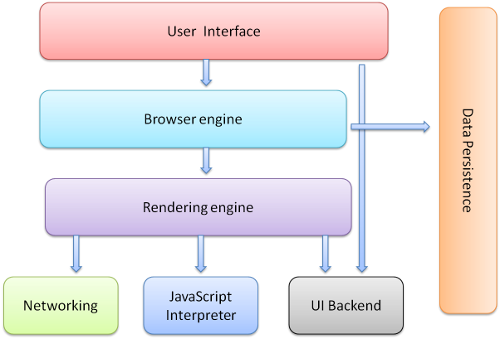

# 浏览器如何工作
- 浏览器可以被认为是使用最为广泛的软件，以下篇幅将介绍浏览器的工作原理，我们将看到，从你在地址栏输入google.com到你看到google主页过程中都发生了什么。

------

## 浏览器的种类介绍
- 今天，有五种主流浏览器 ——— Chrome、Firefox、 IE、 Safari及Opera。
- 本文将基于一些开源浏览器的例子 —— Chrome、Firefox及Safari, Safari是部分开源的。

------

## 浏览器的主要功能
- 浏览器的主要功能是将用户选择得web资源呈现出来，它需要从服务器请求资源，并将其显示在浏览器窗口中，资源的格式通常是HTML，也包括PDF、Image以及其他格式。用户用URI(Uniform Resource Identifier 统一资源标识符)来指定所请求资源的位置。
- HTML和CSS规范中规定了浏览器解释html文档的方式，由W3C组织对这些规范进行维护，W3C是负责制定Web标准的组织
- HTML规范的最新版本是，最新的CSS规范版本是
- 浏览器问世以来，浏览器厂商之间的竞争没有停息过，纷纷开发自己浏览器的拓展，对规范的遵循并不完善，这为web开发者带来了严重的兼容性问题。
- 但是，浏览器的用户界面则差不多，常见的用户界面元素包括:
	- 用来输入URI的地址栏;
	- 前进、后退按钮;
	- 书签选项;
	- 用于刷新以及暂停当前加载文档的刷新、暂停按钮;
	- 用于到达主页的主页按钮.
- 奇怪的是，并没有哪个正式公布的规范对于用户界面做出规定，这些是多年来浏览器厂商之间相互模仿和不断改进的结果.
- HTML5并没有规定浏览器必须具有的UI元素，但列出了一些常用元素, 包括地址栏、状态栏以及工具栏。还有一些浏览器有自己专有的功能，比如firefox的下载管理。

------

## 浏览器的主要构成High Level Structure
- 浏览器的主要组件包括:
	- 1. 用户界面 —— 包括地址栏、后退/前进按钮、书签目录等，也就是你所看到的除了用来显示你所请求页面的主窗口之外的其他部分;
	- 2. 浏览器引擎 —— 用来查询以及操作渲染引擎的接口;
	- 3. 渲染引擎 —— 用来显示请求的内容，例如，如果请求内容为html，它负责解析html以及css，并将解析后的结果显示出来;
	- 4. 网络 —— 用来完成网络调用，例如http请求，它具有与平台无关的接口进行通信的功能，可以在不同平台上工作;
	- 5. UI(User Interface)后端 —— 用来绘制类似组合选择框及对话框等基本组件，具有不特定某个平台的通用接口，底层使用操作系统的用户接口;
	- 6. JS解释器 —— 用来解释执行JS代码
	- 7. 数据存储 —— 属于持久层，浏览器需要在硬盘中保存类似cookie的各种数据，HTML5定义了web database技术，这是一种轻量级完整的客户端存储技术。

> 需要注意的是, Google Chrome浏览器不同于大部分浏览器，Google Chrome浏览器为每个Tab分配了各自的渲染引擎实例，每个Tab就是一个独立的进程。

- 对于构成浏览器的这些组件详细原理分析，后面会持续更新。

------

## 组件间的通信Communication between the components
- Firefox和Chrome都开发了一个特殊的通信结构，后面会详细讨论

------

## 渲染引擎 The rendering engine
- 渲染引擎的职责就是渲染，即在浏览器窗口中显示所请求的内容。
- 默认情况下，渲染引擎可以显示html、xml文档以及图片，它也可以借助插件(一种浏览器扩展)显示其他类型数据，例如使用PDF阅读器插件，可以显示PDF格式，将由专门一章讲解插件以及其扩展，这里只讨论渲染引擎最主要的用途——显示应用了CSS之后的html以及图片。

### 渲染引擎 Rendering engines
- 本文所讨论的浏览器——Firefox、Chrome和Safari是基于两种渲染引擎构建的，Firefox基于Geoko——Firefox公司自主研发的一款渲染引擎，Safari和Chrome是基于Webkit。
- Webkit是一款开源渲染引擎，它本来是为Linux平台研发的，后来由Apple移植到Mac以及Windows上，Webkit参考[http://webkit.org](http://webkit.org)

### 主流程 The main flow
- 渲染引擎首先通过网络获取所请求文档的内容，通常以8K分块的方式完成。

#### 下面是渲染引擎在取得内容之后的基本流程
- **解析html以构建dom树**->**构建render树**->**布局render树**->**绘制render树**
- 如下图所示:

- 渲染引擎开始解析html，并将标签转换为内容树中的dom节点。接着，它解析外部CSS文件以及style标签中的样式信息。这些样式信息以及html中的可见性指令将被用来构建另一棵树——render树;
- render树由一些包含有颜色和大小等属性的矩形组成，它们将被按照正常的顺序显示到屏幕上。
- render树构建好了之后，将会执行布局过程，它将确定每个节点在屏幕上的确切坐标。 再下一步就是绘制，即遍历render树，并使用UI后端层绘制每个节点。
- 值得注意的是，这个过程是逐步完成的，为了更好的用户体验，渲染引擎将会尽可能早的将内容呈现到屏幕上，并不会等到所有的html都解析完成之后再去构建和布局render树。它是解析完一部分内容就显示一部分内容，同时，可能还在通过网络下载其余内容。

- 从图3和图4中可以看出，尽管webkit和Gecko使用的术语稍有不同，他们的主要流程基本相同。Gecko称可见的格式化元素组成的树为frame树，每个元素都是一个frame，webkit则使用render树这个名词来命名由渲染对象组成的树。Webkit中元素的定位成为布局，而Gecko中称为回流。Webkit称利用dom节点以及样式信息去构建render树的过程为attachment，Gecko在html和dom树之间附加了一层，这层称为内容接收器，相当制造dom元素的工厂。下面将讨论流程中的各个阶段。

### 解析 Parsing-general
- 既然解析是渲染引擎中一个非常重要的过程，我们将稍微深入的研究它。首先简要介绍一下解析。
- 解析一个文档即将其转换为具有一定意义的结构——**编码可以理解和使用的东西**。解析的结果通常是表达**文档结构的节点树**，称为解析树或者语法树。
- 例如，解析"2+3-1"这个表达是，可能返回这样一棵树。

#### 文法
- 解析基于文档依据的语法规则——文档的语法或者格式。每种可以被解析的格式必须具有由词汇以及语法规则组成的特定的文法，称为上下文无关文法。
> 人类语言不具有这一特性，因此不能被一般的解析技术所解析。

#### 解析器 —— 词法分析器
- 解析可以分为两个子进程——词法分析以及语法分析
- **词法分析**就是将输入分解为符号，符号是语言的词汇表——基本有效单元的集合。对于人类语言来说，它相当于我们字典中出现的所有单词。
- **语法分析**指对语言应用语法规则。
- 解析器一般将工作分配给两个组件——词法分析器(有时也叫分词器)负责将输入分解为合法的符号，解析器则根据语言的语法规则分析文档结构，从而构建解析树，词法分析器知道怎么跳过空白和换行之类的无关字符。

- 解析过程是**迭代**的，解析器从词法分析器处取到一个新的符号，并试着用这个符号匹配一条语法规则，如果匹配了一条规则，这个符号对应的节点将被添加到解析树上，然后解析器请求另一个符号。如果没有匹配到规则，解析器将在内部保存该符号，并从词法分析器下一个符号，直到所有内部保存的符号能够匹配一项语法规则。如果最终没有找到匹配的规则，解析器将抛出一个异常，这意味着文档无效或者是包含语法错误。

#### 转换
- 很多时候，解析树并不是最终结果。解析一般在转换中使用——将输入文档转换为另一种格式。编译就是个例子，编译器在将一段源码编译为机器码的时候，先将源码解析为解析树，然后将该树转换为一个机器文档码。

#### 解析实例
- 图5中，我们从一个数学表达式构建了一个解析树，这里定义了一个简单的数学语言来看下解析过程。
- 词汇表: 我们的语言包括整数、加号以及减号。
- 语法:
	- 1. 该语言的语法基本单元包括表达式、term以及操作符；
	- 2. 该语言可以包括多个表达式；
	- 3. 一个表达式定义为两个term通过一个操作符连接；
	- 4. 操作符可以是加号或者减号；
	- 5. term可以是一个证书或者是一个表达式。
- 现在来分析一下"2+3-1"这个输入
- 第一个规则的子字符串是"2"，根据规则5，它是一个term，第二个匹配的是"2+3"，它符合第2条规则——一个操作符连接两个term，下一次匹配发生在输入的结束处。"2+3-1"是一个表达式，因为我们知道"2+3"是一个term，所以我们有了一个term紧跟着一个操作符以及另一个term。"2++"将不会匹配任何规则，因此是一个无效输入。

#### 词汇表以及语法的定义

