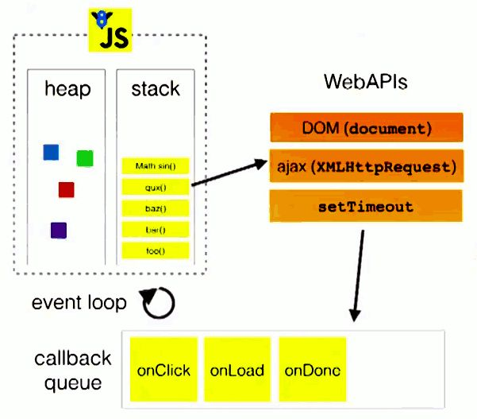

# Summary


## JavaScript

### addEventListener第三个参数的作用?

### js事件阶段（捕获>目标>冒泡），阻止冒泡有哪些方法

``` javascript
event.stopPropagation();
// 事件处理过程中，阻止了事件冒泡，但不会阻击默认行为

return false;
// 事件处理过程中，阻止了事件冒泡，也阻止了默认行为

还有一种有冒泡有关的： 
event.preventDefault();
// 它的作用是：事件处理过程中，不阻止事件冒泡，但阻止默认行为
```

### 如何监听dom的变动（Mutation Observer）

- MutationObserver接口提供了监视对DOM树所做更改的能力。它被设计为旧的Mutation Events功能的替代品，该功能是DOM3 Events规范的一部分。

- 构造函数
	- `MutationObserver()`
	- 创建并返回一个新的` MutationObserver `它会在指定的DOM发生变化时被调用。

- 方法
- `disconnect()`
	- 阻止` MutationObserver `实例继续接收的通知，直到再次调用其`observe()`方法，该观察者对象包含的回调函数都不会再被调用。

- `observe()`
	- 配置`MutationObserver`在DOM更改匹配给定选项时，通过其回调函数开始接收通知。

- `takeRecords()`
	- 从MutationObserver的通知队列中删除所有待处理的通知，并将它们返回到MutationRecord对象的新Array中。

- Example:

```html
<!DOCTYPE html>
<ol contenteditable oninput="">
  <li>Press enter</li>
</ol>
<script>
  var MutationObserver = window.MutationObserver || window.WebKitMutationObserver || window.MozMutationObserver;
  var list = document.querySelector('ol');
  
  var observer = new MutationObserver(function(mutations) {  
    mutations.forEach(function(mutation) {
      if (mutation.type === 'childList') {
        var list_values = [].slice.call(list.children)
            .map( function(node) { return node.innerHTML; })
            .filter( function(s) {
              if (s === '<br>') {
                return false;
              }
              else {
                return true;
              }
         });
        console.log(list_values);
      }
    });
  });
  
  observer.observe(list, {
  	attributes: true, 
  	childList: true, 
  	characterData: true
  });
</script>
```

### 简述Event loop/描述场景问你执行顺序等，要熟悉事件循环机制

- 我们都知道，javascript从诞生之日起就是一门单线程的非阻塞的脚本语言。这是由其最初的用途来决定的：与浏览器交互。

- 单线程意味着，javascript代码在执行的任何时候，都只有一个主线程来处理所有的任务。

- 而非阻塞则是当代码需要进行一项异步任务（无法立刻返回结果，需要花一定时间才能返回的任务，如I/O事件）的时候，主线程会挂起（pending）这个任务，然后在异步任务返回结果的时候再根据一定规则去执行相应的回调。

- 单线程是必要的，也是javascript这门语言的基石，原因之一在其最初也是最主要的执行环境——浏览器中，我们需要进行各种各样的dom操作。试想一下 如果javascript是多线程的，那么当两个线程同时对dom进行一项操作，例如一个向其添加事件，而另一个删除了这个dom，此时该如何处理呢？因此，为了保证不会 发生类似于这个例子中的情景，javascript选择只用一个主线程来执行代码，这样就保证了程序执行的一致性。

- 当然，现如今人们也意识到，单线程在保证了执行顺序的同时也限制了javascript的效率，因此开发出了web worker技术。这项技术号称让javascript成为一门多线程语言。

- 然而，使用web worker技术开的多线程有着诸多限制，例如：所有新线程都受主线程的完全控制，不能独立执行。这意味着这些“线程” 实际上应属于主线程的子线程。另外，这些子线程并没有执行I/O操作的权限，只能为主线程分担一些诸如计算等任务。所以严格来讲这些线程并没有完整的功能，也因此这项技术并非改变了javascript语言的单线程本质。

- 可以预见，未来的javascript也会一直是一门单线程的语言。

- 话说回来，前面提到javascript的另一个特点是“非阻塞”，那么javascript引擎到底是如何实现的这一点呢？答案就是今天这篇文章的主角——event loop（事件循环）。

> 注：虽然nodejs中的也存在与传统浏览器环境下的相似的事件循环。然而两者间却有着诸多不同，故把两者分开，单独解释。


#### 浏览器环境下js引擎的事件循环机制
##### 1.执行栈与事件队列

- 当javascript代码执行的时候会将不同的变量存于内存中的不同位置：堆（heap）和栈（stack）中来加以区分。其中，堆里存放着一些对象。而栈中则存放着一些基础类型变量以及对象的指针。 但是我们这里说的执行栈和上面这个栈的意义却有些不同。

- 我们知道，当我们调用一个方法的时候，js会生成一个与这个方法对应的执行环境（context），又叫执行上下文。这个执行环境中**存在着这个方法的私有作用域**，**上层作用域的指向**，**方法的参数**，**这个作用域中定义的变量**以及**这个作用域的this对象**。 而当一系列方法被依次调用的时候，因为js是单线程的，同一时间只能执行一个方法，于是这些方法被排队在一个单独的地方。这个地方被称为执行栈。

- 当一个脚本第一次执行的时候，js引擎会解析这段代码，并将其中的同步代码按照执行顺序加入执行栈中，然后从头开始执行。如果当前执行的是一个方法，那么js会向执行栈中添加这个方法的执行环境，然后进入这个执行环境继续执行其中的代码。当这个执行环境中的代码 执行完毕并返回结果后，js会退出这个执行环境并把这个执行环境销毁，回到上一个方法的执行环境。。这个过程反复进行，直到执行栈中的代码全部执行完毕。

下面这个图片非常直观的展示了这个过程，其中的global就是初次运行脚本时向执行栈中加入的代码：


- 从图片可知，一个方法执行会向执行栈中加入这个方法的执行环境，在这个执行环境中还可以调用其他方法，甚至是自己，其结果不过是在执行栈中再添加一个执行环境。这个过程可以是无限进行下去的，除非发生了栈溢出，即超过了所能使用内存的最大值。

- 以上的过程说的都是同步代码的执行。那么当一个异步代码（如发送ajax请求数据）执行后会如何呢？前文提过，js的另一大特点是非阻塞，实现这一点的关键在于下面要说的这项机制——**事件队列（Task Queue）**。

- js引擎遇到一个异步事件后并不会一直等待其返回结果，而是会将这个事件挂起，继续执行执行栈中的其他任务。当一个异步事件返回结果后，js会将这个事件加入与当前执行栈不同的另一个队列，我们称之为事件队列。被放入事件队列不会立刻执行其回调，而是等待当前执行栈中的所有任务都执行完毕， 主线程处于闲置状态时，主线程会去查找事件队列是否有任务。如果有，那么主线程会从中取出排在第一位的事件，并把这个事件对应的回调放入执行栈中，然后执行其中的同步代码...，如此反复，这样就形成了一个无限的循环。这就是这个过程被称为**“事件循环（Event Loop）”**的原因。

- 这里还有一张图来展示这个过程：



- 图中的stack表示我们所说的执行栈，web apis则是代表一些异步事件，而callback queue即事件队列。

##### 2.macro task与micro task
- 以上的事件循环过程是一个宏观的表述，实际上因为异步任务之间并不相同，因此他们的执行优先级也有区别。不同的异步任务被分为两类：**微任务（micro task）**和**宏任务（macro task）**。

- 以下事件属于宏任务：

``` javascript
setInterval()
setTimeout()
```

- 以下事件属于微任务:


``` javascript
new Promise()
new MutaionObserver()
```

- 前面我们介绍过，在一个事件循环中，异步事件返回结果后会被放到一个任务队列中。然而，根据这个异步事件的类型，这个事件实际上会被对应的宏任务队列或者微任务队列中去。并且在当前执行栈为空的时候，主线程会查看微任务队列是否有事件存在。如果不存在，那么再去宏任务队列中取出一个事件并把对应的回到加入当前执行栈；如果存在，则会依次执行队列中事件对应的回调，直到微任务队列为空，然后去宏任务队列中取出最前面的一个事件，把对应的回调加入当前执行栈...如此反复，进入循环。

- 我们只需记住当 **当前执行栈执行完毕时会立刻先处理所有微任务队列中的事件**，**然后再去宏任务队列中取出一个事件**。同一次事件循环中，**微任务永远在宏任务之前执行**。

- 这样就能解释下面这段代码的结果：

``` javascript
setTimeout(function () {
    console.log(1);
});

new Promise(function(resolve,reject){
    console.log(2)
    resolve(3)
}).then(function(val){
    console.log(val);
})
```

- 结果为：
```javascript
2
3
1
```

#### node环境下的事件循环机制node环境下的事件循环机制
##### 1. 与浏览器环境有何不同?

- 在node中，事件循环表现出的状态与浏览器中大致相同。不同的是node中有一套自己的模型。node中事件循环的实现是依靠的libuv引擎。我们知道node选择chrome v8引擎作为js解释器，v8引擎将js代码分析后去调用对应的node api，而这些api最后则由libuv引擎驱动，执行对应的任务，并把不同的事件放在不同的队列中等待主线程执行。 因此实际上node中的事件循环存在于libuv引擎中。

##### 2. 事件循环模型

- 下面是一个libuv引擎中的事件循环的模型:

```
┌───────────────────────┐
┌─>│        timers         │
│  └──────────┬────────────┘
│  ┌──────────┴────────────┐
│  │     I/O callbacks     │
│  └──────────┬────────────┘
│  ┌──────────┴────────────┐
│  │     idle, prepare     │
│  └──────────┬────────────┘      ┌───────────────┐
│  ┌──────────┴────────────┐      │   incoming:   │
│  │         poll          │<──connections───     │
│  └──────────┬────────────┘      │   data, etc.  │
│  ┌──────────┴────────────┐      └───────────────┘
│  │        check          │
│  └──────────┬────────────┘
│  ┌──────────┴────────────┐
└──┤    close callbacks    │
   └───────────────────────┘
```

> 注：模型中的每一个方块代表事件循环的一个阶段

- 这个模型是node官网上的一篇文章中给出的，我下面的解释也都来源于这篇文章。我会在文末把文章地址贴出来，有兴趣的朋友可以亲自与看看原文。

##### 3.事件循环各阶段详解

- 从上面这个模型中，我们可以大致分析出node中的事件循环的顺序：

```javascript
外部输入数据-->轮询阶段(poll)-->检查阶段(check)-->关闭事件回调阶段(close callback)-->定时器检测阶段(timer)-->I/O事件回调阶段(I/O callbacks)-->闲置阶段(idle, prepare)-->轮询阶段...
```

- 以上各阶段的名称是根据我个人理解的翻译，为了避免错误和歧义，下面解释的时候会用英文来表示这些阶段。

- 这些阶段大致的功能如下：
  - `timers`: 这个阶段执行定时器队列中的回调如 setTimeout() 和 setInterval()。
  - `I/O callbacks`: 这个阶段执行几乎所有的回调。但是不包括close事件，定时器和setImmediate()的回调。
  - `idle, prepare`: 这个阶段仅在内部使用，可以不必理会。
  - `poll`: 等待新的I/O事件，node在一些特殊情况下会阻塞在这里。
  - `check`: setImmediate()的回调会在这个阶段执行。
  - `close callbacks`: 例如socket.on('close', ...)这种close事件的回调。

- 下面我们来按照代码第一次进入libuv引擎后的顺序来详细解说这些阶段：

- poll阶段
  - 当个v8引擎将js代码解析后传入libuv引擎后，循环首先进入poll阶段。poll阶段的执行逻辑如下： 先查看poll queue中是否有事件，有任务就按先进先出的顺序依次执行回调。 当queue为空时，会检查是否有setImmediate()的callback，如果有就进入check阶段执行这些callback。但同时也会检查是否有到期的timer，如果有，就把这些到期的timer的callback按照调用顺序放到timer queue中，之后循环会进入timer阶段执行queue中的 callback。 这两者的顺序是不固定的，收到代码运行的环境的影响。如果两者的queue都是空的，那么loop会在poll阶段停留，直到有一个i/o事件返回，循环会进入i/o callback阶段并立即执行这个事件的callback。
  - 值得注意的是，poll阶段在执行poll queue中的回调时实际上不会无限的执行下去。有两种情况poll阶段会终止执行poll queue中的下一个回调：1.所有回调执行完毕。2.执行数超过了node的限制。
- check阶段
  - check阶段专门用来执行setImmediate()方法的回调，当poll阶段进入空闲状态，并且setImmediate queue中有callback时，事件循环进入这个阶段。
- close阶段
  - 当一个socket连接或者一个handle被突然关闭时（例如调用了socket.destroy()方法），close事件会被发送到这个阶段执行回调。否则事件会用process.nextTick（）方法发送出去。
- timer阶段
  - 这个阶段以先进先出的方式执行所有到期的timer加入timer队列里的callback，一个timer callback指得是一个通过setTimeout或者setInterval函数设置的回调函数。
- I/O callback阶段
  - 如上文所言，这个阶段主要执行大部分I/O事件的回调，包括一些为操作系统执行的回调。例如一个TCP连接生错误时，系统需要执行回调来获得这个错误的报告。

#### process.nextTick,setTimeout与setImmediate的区别与使用场景
- 在node中有三个常用的用来推迟任务执行的方法：process.nextTick,setTimeout（setInterval与之相同）与setImmediate
这三者间存在着一些非常不同的区别：

##### process.nextTick()
- 尽管没有提及，但是实际上node中存在着一个特殊的队列，即nextTick queue。这个队列中的回调执行虽然没有被表示为一个阶段，当时这些事件却会在每一个阶段执行完毕准备进入下一个阶段时优先执行。当事件循环准备进入下一个阶段之前，会先检查nextTick queue中是否有任务，如果有，那么会先清空这个队列。与执行poll queue中的任务不同的是，这个操作在队列清空前是不会停止的。这也就意味着，错误的使用process.nextTick()方法会导致node进入一个死循环。。直到内存泄漏。

- 那么合适使用这个方法比较合适呢？下面有一个例子：

```javascript
const server = net.createServer(() => {}).listen(8080);

server.on('listening', () => {});
```

- 这个例子中当，当listen方法被调用时，除非端口被占用，否则会立刻绑定在对应的端口上。这意味着此时这个端口可以立刻触发listening事件并执行其回调。然而，这时候on('listening)还没有将callback设置好，自然没有callback可以执行。为了避免出现这种情况，node会在listen事件中使用process.nextTick()方法，确保事件在回调函数绑定后被触发。

##### setTimeout()和setImmediate()
- 在三个方法中，这两个方法最容易被弄混。实际上，某些情况下这两个方法的表现也非常相似。然而实际上，这两个方法的意义却大为不同。

- setTimeout()方法是定义一个回调，并且希望这个回调在我们所指定的时间间隔后第一时间去执行。注意这个“第一时间执行”，这意味着，受到操作系统和当前执行任务的诸多影响，该回调并不会在我们预期的时间间隔后精准的执行。执行的时间存在一定的延迟和误差，这是不可避免的。node会在可以执行timer回调的第一时间去执行你所设定的任务。

- setImmediate()方法从意义上将是立刻执行的意思，但是实际上它却是在一个固定的阶段才会执行回调，即poll阶段之后。有趣的是，这个名字的意义和之前提到过的process.nextTick()方法才是最匹配的。node的开发者们也清楚这两个方法的命名上存在一定的混淆，他们表示不会把这两个方法的名字调换过来---因为有大量的node程序使用着这两个方法，调换命名所带来的好处与它的影响相比不值一提。

- setTimeout()和不设置时间间隔的setImmediate()表现上及其相似。猜猜下面这段代码的结果是什么？

```javascript
setTimeout(() => {
    console.log('timeout');
}, 0);

setImmediate(() => {
    console.log('immediate');
});
```

- 实际上，答案是不一定。没错，就连node的开发者都无法准确的判断这两者的顺序谁前谁后。这取决于这段代码的运行环境。运行环境中的各种复杂的情况会导致在同步队列里两个方法的顺序随机决定。但是，在一种情况下可以准确判断两个方法回调的执行顺序，那就是在一个I/O事件的回调中。下面这段代码的顺序永远是固定的：

``` javascript
const fs = require('fs');

fs.readFile(__filename, () => {
    setTimeout(() => {
        console.log('timeout');
    }, 0);
    setImmediate(() => {
        console.log('immediate');
    });
});
```

- 答案永远是：

``` javascript
immediate
timeout
```

- 因为在I/O事件的回调中，setImmediate方法的回调永远在timer的回调前执行。

#### 尾声
- javascript的事件循环是这门语言中非常重要且基础的概念。清楚的了解了事件循环的执行顺序和每一个阶段的特点，可以使我们对一段异步代码的执行顺序有一个清晰的认识，从而减少代码运行的不确定性。合理的使用各种延迟事件的方法，有助于代码更好的按照其优先级去执行。这篇文章期望用最易理解的方式和语言准确描述事件循环这个复杂过程，但由于作者自己水平有限，文章中难免出现疏漏。如果您发现了文章中的一些问题，欢迎在留言中提出，我会尽量回复这些评论，把错误更正。

### 了解宏任务和微任务吗，请各举几个常见的/宏任务与微任务哪个先执行


### 简述原型，原型链/描述场景问指向等

#### 原型 prototype 和 __proto__
- 每个对象都有一个__proto__属性，并且指向它的prototype原型对象
- 每个构造函数都有一个prototype原型对象
  - prototype原型对象里的constructor指向构造函数本身


- 实例对象的__proto__指向构造函数的prototype，从而实现继承。
- `prototype`对象相当于**特定类型**所有实例对象都可以访问的公共容器

``` javascript
function Person(nick, age){
  this.nick = nick;
  this.age = age;
}
Person.prototype.sayName = function(){
    console.log(this.nick);
}

var p1 = new Person('Byron', 20);

var p2 = new Person('Casper', 25);

p1.sayName()  // Byron

p2.sayName()  // Casper

p1.__proto__ === Person.prototype       //true

p2.__proto__ === Person.prototype   //true

p1.__proto__ === p2.__proto__           //true

Person.prototype.constructor === Person  //true
```

> 注意
> 1. 当`Object.prototype.__proto__`已被大多数浏览器厂商所支持的今天，其存在和确切行为仅在ECMAScript 2015规范中被标准化为传统功能，以确保Web浏览器的兼容性。为了更好的支持，建议只使用 Object.getPrototypeOf()。
> 2. `Object.create(null)`新建的对象是没有__proto__属性的。

##### 原型链

```javascript
var arr = [1,2,3]
arr.valueOf()  //  [1, 2, 3]
```


- 按照之前的理论，如果自身没有该方法，我们应该去Array.prototype对象里去找，但是你会发现arr.__proto__上压根就没有valueOf方法，那它是从哪里来的呢？


- 很奇怪我们在Array.prototype.__proto__里找到了valueOf方法，为什么呢？

- 查找valueOf方法的过程

- 当试图访问一个对象的属性时，它不仅仅在该对象上搜寻，还会搜寻该对象的原型，以及该对象的原型的原型，依次层层向上搜索，直到找到一个名字匹配的属性或到达原型链的末尾。

- 查找valueOf大致流程
  - 当前实例对象obj，查找obj的属性或方法，找到后返回没有找到，通过obj.__proto__，找到**obj构造函数的prototype并且查找上面的属性和方法**，**找到后返回没有找到，把Array.prototype当做obj，重复以上步骤**


- 我们来看看上图的关系

```javascript
arr.__proto__ === Array.prototype
true
Array.prototype.__proto__ === Object.prototype
true
arr.__proto__.__proto__ === Object.prototype
true

// 原型链的终点
Object.prototype.__proto__ === null
true
```

- 当然不会一直找下去，原型链是有终点的，最后查找到Object.prototype时
- `Object.prototype.__proto__ === null`，意味着查找结束

- 原型链如下：

``` javascript
arr ---> Array.prototype ---> Object.prototype ---> null
```

- 这就是传说中的原型链，层层向上查找，最后还没有就返回undefined

##### 什么是继承?
- 继承是指一个对象直接使用另外一个对象的属性和方法
- 由此可见只要实现属性和方法的继承，就达到继承的效果
  - 得到一个对象的属性
  - 得到一个对象的方法

##### 属性如何继承？
- 我们先创建一个Person类

``` javascript
function Person (name, age) {
    this.name = name
    this.age = age
}
// 方法定义在构造函数的原型上
Person.prototype.getName = function () { console.log(this.name)}
```

- 此时我想创建一个Teacher类，我希望它可以继承Person所有的属性，并且额外添加属于自己特定的属性；
- 一个新的属性，subject——这个属性包含了教师教授的学科。
- 定义Teacher的构造函数
``` javascript
function Teacher (name, age, subject) {
  Person.call(this, name, age)
  this.subject = subject
}
```

- **属性的继承是通过在一个类内执行另外一个类的构造函数，通过call指定this为当前执行环境，这样就可以得到另外一个类的所有属性。**

``` javascript
Person.call(this, name, age)
```

- 我们实例化一下看看
```javascript
var teacher = new Teacher('jack', 25, Math)
teacher.age
25
teacher.name
"jack"
```

- 很明显Teacher成功继承了Person的属性

##### 方法如何继承？
- 我们需要让Teacher从Person的原型对象里继承方法。我们要怎么做呢？

- 我们都知道类的方法都定义在prototype里，那其实我们只需要把Person.prototype的备份赋值给Teacher.prototype即可

```javascript
Teacher.prototype = Object.create(Person.prototype)
```

- Object.create简单说就是新建一个对象，使用现有的对象赋值给新建对象的__proto__

- 可能有人会问为什么是备份呢？
- 因为如果直接赋值，那会是引用关系，意味着修改Teacher. prototype，也会同时修改Person.prototype，这是不合理的。


- 另外注意一点就是，在给Teacher类添加方法时，应该在修改prototype以后，否则会被覆盖掉，原因是赋值前后的属性值是不同的对象。
- 最后还有一个问题，我们都知道prototype里有个属性constructor指向构造函数本身，但是因为我们是复制其他类的prototype，所以这个指向是不对的，需要更正一下。
如果不修改，会导致我们类型判断出错

```javascript
Teacher.prototype.constructor = Teacher

Teacher.prototype = Object.create(Person.prototype)

Teacher.prototype.constructor
ƒ Person(name, age) {
    this.name = name
    this.age = age
}

---

Teacher.prototype.constructor = Teacher
ƒ Teacher(name, age, subject) {
    Person.call(this, name, age)
    this.subject = subject
}
```

- 继承方法的最终方案：
```javascript
Teacher.prototype = Object.create(Person.prototype)
Teacher.prototype.constructor = Teacher
```

##### hasOwnProperty
- 在原型链上查询属性比较耗时，对性能有影响，试图访问不存在的属性时会遍历整个原型链。
- 遍历对象属性时，每个可枚举的属性都会被枚举出来。 要检查是否具有自己定义的属性，而不是原型链上的属性，必须使用hasOwnProperty方法。
- hasOwnProperty 是 JavaScript 中唯一处理属性并且不会遍历原型链的方法。

##### 总结
- `prototype` 和 `__proto__`
- 每个对象都有一个__proto__属性，并且指向它的prototype原型对象每个构造函数都有一个prototype原型对象
- `prototype`原型对象里的constructor指向构造函数本身


##### 原型链

- 每个对象都有一个__proto__，它指向它的prototype原型对象，而prototype原型对象又具有一个自己的prototype原型对象，就这样层层往上直到一个对象的原型prototype为null
- 这个查询的路径就是原型链

##### JavaScript 中的继承

- 属性继承 
```javascript
function Person (name, age) {
    this.name = name
    this.age = age
}

// 方法定义在构造函数的原型上
Person.prototype.getName = function () { console.log(this.name)}

function Teacher (name, age, subject) {
    Person.call(this, name, age)
    this.subject = subject
}
```

- 方法继承
```javascript
Teacher.prototype = Object.create(Person.prototype)
Teacher.prototype.constructor = Teacher
```

- 对于使用过基于类的语言 (如 Java 或 C++) 的开发人员来说，JavaScript 有点令人困惑，因为它是动态的，并且本身不提供一个 class 实现。（在 ES2015/ES6 中引入了 class 关键字，但那只是语法糖，JavaScript 仍然是基于原型的）。

- 当谈到继承时，JavaScript 只有一种结构：对象。**每个实例对象（ object ）都有一个私有属性（称之为 __proto__ ）指向它的构造函数的原型对象（prototype ）**。**该原型对象也有一个自己的原型对象( __proto__ )** ，**层层向上直到一个对象的原型对象为 null**。根据定义，**null 没有原型**，并作为这个原型链中的最后一个环节。

- 几乎所有 JavaScript 中的对象都是位于原型链顶端的 Object 的实例。

- 尽管这种原型继承通常被认为是 JavaScript 的弱点之一，但是原型继承模型本身实际上比经典模型更强大。例如，在原型模型的基础上构建经典模型相当简单。

#### 基于原型链的继承
#### 继承属性

- JavaScript 对象是动态的属性“包”（指其自己的属性）。JavaScript 对象有一个指向一个原型对象的链。当试图访问一个对象的属性时，它不仅仅在该对象上搜寻，还会搜寻该对象的原型，以及该对象的原型的原型，依次层层向上搜索，直到找到一个名字匹配的属性或到达原型链的末尾。

>  遵循ECMAScript标准，someObject.[[Prototype]] 符号是用于指向 someObject 的原型。从 ECMAScript 6 开始，[[Prototype]] 可以通过 Object.getPrototypeOf() 和 Object.setPrototypeOf() 访问器来访问。这个等同于 JavaScript 的非标准但许多浏览器实现的属性 __proto__。

> 但它不应该与构造函数 func 的 prototype 属性相混淆。被构造函数创建的实例对象的 [[Prototype]] 指向 func 的 prototype 属性。Object.prototype 属性表示 Object 的原型对象。

```javascript
// 让我们从一个函数里创建一个对象o，它自身拥有属性a和b的：
let f = function () {
   this.a = 1;
   this.b = 2;
}
/* 这么写也一样
function f() {
  this.a = 1;
  this.b = 2;
}
*/
let o = new f(); // {a: 1, b: 2}

// 在f函数的原型上定义属性
f.prototype.b = 3;
f.prototype.c = 4;

// 不要在 f 函数的原型上直接定义 f.prototype = {b:3,c:4};这样会直接打破原型链
// o.[[Prototype]] 有属性 b 和 c
//  (其实就是 o.__proto__ 或者 o.constructor.prototype)
// o.[[Prototype]].[[Prototype]] 是 Object.prototype.
// 最后o.[[Prototype]].[[Prototype]].[[Prototype]]是null
// 这就是原型链的末尾，即 null，
// 根据定义，null 就是没有 [[Prototype]]。

// 综上，整个原型链如下: 

// {a:1, b:2} ---> {b:3, c:4} ---> Object.prototype---> null

console.log(o.a); // 1
// a是o的自身属性吗？是的，该属性的值为 1

console.log(o.b); // 2
// b是o的自身属性吗？是的，该属性的值为 2
// 原型上也有一个'b'属性，但是它不会被访问到。
// 这种情况被称为"属性遮蔽 (property shadowing)"

console.log(o.c); // 4
// c是o的自身属性吗？不是，那看看它的原型上有没有
// c是o.[[Prototype]]的属性吗？是的，该属性的值为 4

console.log(o.d); // undefined
// d 是 o 的自身属性吗？不是，那看看它的原型上有没有
// d 是 o.[[Prototype]] 的属性吗？不是，那看看它的原型上有没有
// o.[[Prototype]].[[Prototype]] 为 null，停止搜索
// 找不到 d 属性，返回 undefined
```

- 给对象设置属性会创建自有属性。获取和设置属性的唯一限制是内置 getter 或 setter 的属性。

##### 继承方法

- JavaScript 并没有其他基于类的语言所定义的“方法”。在 JavaScript 里，任何函数都可以添加到对象上作为对象的属性。函数的继承与其他的属性继承没有差别，包括上面的“属性遮蔽”（这种情况相当于其他语言的方法重写）。

- 当继承的函数被调用时，**this 指向的是当前继承的对象**，**而不是继承的函数所在的原型对象**。

```javascript
var o = {
  a: 2,
  m: function(){
    return this.a + 1;
  }
};

console.log(o.m()); // 3
// 当调用 o.m 时，'this' 指向了 o.

var p = Object.create(o);
// p是一个继承自 o 的对象

p.a = 4; // 创建 p 的自身属性 'a'
console.log(p.m()); // 5
// 调用 p.m 时，'this' 指向了 p
// 又因为 p 继承了 o 的 m 函数
// 所以，此时的 'this.a' 即 p.a，就是 p 的自身属性 'a' 
```


### es6平时开发中常用那些属性

### es6的class与其继承如何实现

- ES6引入的class和原有的JavaScript原型继承有什么区别呢？实际上它们没有任何区别，**class的作用就是让JavaScript引擎去实现原来需要我们自己编写的原型链代码**。简而言之，用**class的好处就是极大地简化了原型链代码**。

### 箭头函数和普通函数有什么区别/箭头函数的优点

- 箭头函数相当于匿名函数，不能作为构造函数，不能new，所以也没有原型属性这一说；

- 箭头函数不绑定arguments，使用rest参数；

- 不绑定this，会捕获上下文的this，作为自己的this值。

### call，apply，bind的作用与不同之处

### 你知道几种深拷贝的方法

## HTML5新特性

### html5有什么新的特性

------

## css类

### 简述下flex布局

### 简述下grid布局

### 你可以用几种方式来实现水平垂直居中

### css3有哪些新的属性

### position有哪些值/absolute以什么作为父级/简述sticky属性

### 了解BFC吗，BFC可以用来解决什么问题

### display:none和visibliy:hidden的区别

------

## Vue类
### Vue的双向绑定原理

### vue3.0和2.0双向绑定的区别，这样的改动有什么好处

### vue-router的实现原理，history和hash模式有什么区别

### 虚拟dom为什么效率高

### 请描述vue生命周期

### keep-alive是否与普通组件有一样的生命周期，如果不是，它有哪些钩子

### vue如何实现seo/为什么会被seo搜索到，ssr的生命周期与普通vue生命周期有什么不一样

### computed如何得知数据变化/computed有缓存吗

### $nextTick原理

### vue父子组件传参有哪些方式

### v-if和v-show有什么区别

------

## http类

### 跨域有哪些方式，有些面试会问jsonp和Nginx的原理，其他的原理倒是没怎么问

### jsonp回调函数参数格式/如何设置回调

### 后端修改请求头，实现cros跨域时，在发送post请求之前会先发送什么

### 列举一些http状态码，每一类起码都要列出几个来

### http，tcp，ip各处在什么层

### http2.0与http1.x相比有哪些优化/http发展历程

### http都有哪些请求方式

### 了解过http连接池吗

### 浏览器的缓存机制，如何实现协商缓存（etag）

### 简述从浏览器输入地址到页面渲染完成之间发生了什么

------

## 性能类

### 实际项目中做过的性能优化，优化之后效果怎么样

### 一个页面中有大量的数据，如何优化页面

### 一个页面中有大量的图片，如何优化页面

### 图片除了雪碧图，还有什么可以优化的方式

### 为什么gzip不压缩图片

### 单页应用的首屏优化

### 请简述cookie,localstorage,sessionstorage的区别

------


## 技术其他类

### 平时的工作中如何保证产品在不同浏览器中的兼容问题

### 有考虑过前端模块化的问题吗

### 对webpack有没有了解，自己有写过webpack配置文件吗/是否有改过webpack的配置

### 对脚手架工具有没有了解，自己有实现过吗

### 搭建项目时会对整体的开发做哪些考虑/搭建项目时会考虑哪些因素，会做哪些规划

### 如何制作骨架屏

### 是否了解过seo

### 简述mvc和mvvm

### 请简述重绘和重排

### （如果简历有写使用ts）简述使用ts的好处

------

## 认证类

### 介绍OAuth

- OAuth： OAuth（开放授权）是一个开放标准，允许用户授权第三方移动应用访问他们存储在另外的服务提供者上的信息，而不需要将用户名和密码提供给第三方移动应用或分享他们数据的所有内容。

------

## 移动端

### 对flutter的了解

### weex和rn原理

------

## 大屏端

### 大屏用的技术

### 大屏数据来源与管理


------


## 状态管路器

### 对vuex的看法

### 