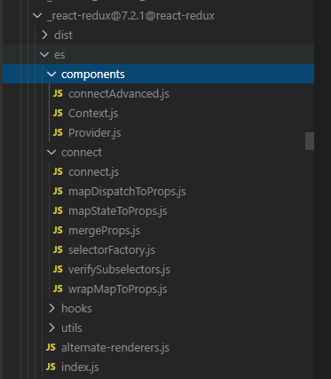

# react-redux的connect和Provider的原理

- react-redux提供connect和Provider将react和redux连接起来。

  - connect: 用于创建容器组件, 可以使容器组件访问到Provider组件通过context提供的store, 并将mapStateToProps和mapDispatchToProps返回的state和dispatch传递给UI组件。
  - Provider: 通过context向子组件提供store。

## 1、connect和Provider的使用

```javascript
// App.jsx
import React from 'react';
import ReactDOM from 'react-dom';
import { Provider } from 'react-redux';
import createStore from 'redux';
import reducer from './reducers';
import Container from './Container';

const store = createStore(reducer);
const App = () => {
  return (
    <Provider store={store}>
      <Container />
    </Provider>
  )
};

ReactDOM.render(<App />, document.getElementById('app'));
```

- 容器组件

```javascript
// Container.jsx
import React from 'react';
import { connect } from 'react-redux';

const mapStateToProps = (state, ownProps) => ({})

const mapDispatchToProps = (dispatch, ownProps) => ({})

export default connect(mapStateToProps, mapDispatchToProps)(Demo)
```

## 2、源码解析

- 先看一看react-redux包的目录结构, 其中es目录适用于ES模块导入, lib适用于commonjs模块导入




## 2.1、Provider源码解析

- Provider组件在Provider.js里面定义, 仅有短短几十行代码, 核心代码如下:

```javascript
import React, { useMemo, useEffect } from 'react';
import PropTypes from 'prop-types';
import { ReactReduxContext } from './Context';
import Subscription from '../utils/Subscription';

function Provider(_ref) {
  var store = _ref.store, // 获取组件绑定的store
      context = _ref.context,
      children = _ref.children; // 获取子组件
  // contextValue的值为{store， subscription}
  var contextValue = useMemo(function () {
    var subscription = new Subscription(store);
    subscription.onStateChange = subscription.notifyNestedSubs;
    return {
      store: store,
      subscription: subscription
    };
  }, [store]);
  var previousState = useMemo(function () {
    return store.getState();
  }, [store]);
  useEffect(function () {
    var subscription = contextValue.subscription;
    subscription.trySubscribe();

    if (previousState !== store.getState()) {
      subscription.notifyNestedSubs();
    }

    return function () {
      subscription.tryUnsubscribe();
      subscription.onStateChange = null;
    };
  }, [contextValue, previousState]);
  // 如果Provider组件上绑定了context就是用绑定的context，如果没有绑定context，就会自己生成context
  // children为嵌套在Provider里层的子组件
  var Context = context || ReactReduxContext;
  return React.createElement(Context.Provider, {
    value: contextValue
  }, children);
}

export default Provider;
```

- 源码中使用了useMemo钩子函数, 只有在第二个参数发生变化时, 第一个参数函数才会执行, 可以提升代码执行性能, 避免每次组件渲染都要执行函数。详情可以去查看官网, 这里制作简单介绍。

```javascript
var Context = context || ReactReduxContext;
return React.createElement(Context.Provider, {
  value: contextValue
}, children);
```

- 我们看看这部分代码, 如果**Provider组件上绑定了context就是用绑定的context**, 如果**没有绑定context, 就会自己生成context**。ReactReduxContext的生成在Context.js中:

```javascript
import React from 'react';
export var ReactReduxContext = 
/*#__PURE__*/
React.createContext(null);

if (process.env.NODE_ENV !== 'production') {
  ReactReduxContext.displayName = 'ReactRedux';
}

export default ReactReduxContext;
```

- 有了context就可以向子组件提供store。

```javascript
<Provider store={store}>
  <Container />
</Provider>

// 等价于
<Provider store={store}>
  <Context.Provider value={{value: contextValue}}>
    <Container />
  </Context.Provider>
</Provider>
```

- 打开react devtool可以看到最外层组件为`<Provider>`, 里层的子组件由`<ReactRedux.Provider>`组件包裹


### 2.2、connect源码解析

- connect使用方法如下:

```javascript
connect(mapStateToProps, mapDispatchToProps)(Demo)
```

- 可以才猜想到connect(mapStateToProps, mapDispatchToProps)这部分将返回一个高阶组件, 这个高阶组件的作用就是将mapStateToProps返回的state和mapDispatchToProps返回的dispatch通过props传递给Demo。我们通过源码来验证一下猜想是否正确。

- connect函数在connect.js中实现, 函数架子大概就是如下样子:

```javascript
export function createConnext(_temp) {
  // coding...
  return function connect(mapStateToProps, mapDispatchToProps, mergeProps, _ref2) {
    // coding...
    return connectHOC(selectorFactory, options);
  };
}

export default createConnect();
```

- 

> https://segmentfault.com/a/1190000022559941
