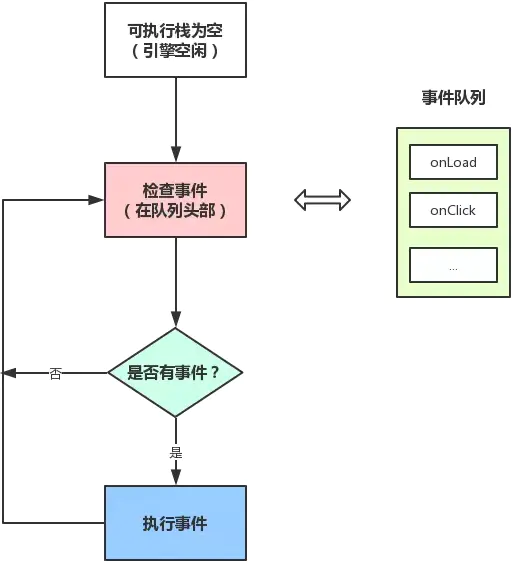
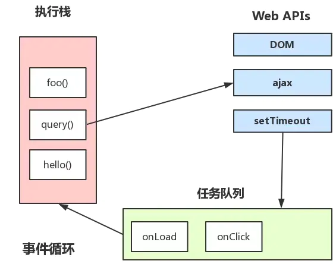

# nextTick
## 为什么是nextTick
- Vue 中有一个API叫做nextTick, 那是为什么需要一个nextTick了？

## 浏览器

- 浏览器(多进程)包含了Browser进程(浏览器的主进程)、第三方插件进程和GPU进程(浏览器渲染进程)、其中GPU进程(多线程)和Web前端密切相关, 包含以下线程:
  - GUI渲染线程
  - JS引擎线程
  - 事件触发线程(和EventLoop密切相关)
  - 定时触发器线程
  - 异步HTTP请求线程

> GUI渲染线程和JS引擎线程是互斥的, 为了防止DOM渲染的不一致性, 其中一个线程执行时另一个线程会被挂起。

- 这些线程中, 和Vue的`nextTick`息息相关的是**JS引擎线程**和**事件触发线程**。

## JS引擎线程和事件触发线程

- 浏览器页面初次渲染完毕后, JS引擎线程结合事件触发线程的工作流程如下:

  - (1) 同步任务在**JS引擎线程**(主线程)上执行, 形成**执行栈**(Execution Context Stack)。
  - (2) 主线程之外, 事件触发线程管理着一个**任务队列**(Task Queue)。只要异步任务有了运行结果, 就在**任务队列**之中放置一个事件。
  - (3) **执行栈**中的同步任务执行完毕, 系统就回读取**任务队列**, 如果有异步任务需要执行, 将其加到主线程的**执行栈**并执行相应的异步任务。

- 主线程的执行流程如下图所示:



> 这里可能是不够严谨的，在本文中**事件队列**和**任务队列**指向同一个概念。

## 事件循环机制

- **事件触发线程**管理的**任务队列**是如何产生的呢? 事实上这些任务就是从**JS引擎线程本身产生的**, 主线程在运行时会**产生执行栈**, 栈中的代码调用某些异步API时会在**任务队列**中添加事件, 栈中的代码执行完毕后, 就会读取**任务队列**中的事件, 去执行事件对应的回调函数, 如此循环往复, 形成事件循环机制, 如下图所示:



## 任务类型

- JS中有两种任务类型: **微任务(microTask)**和**宏任务(macroTask)**, 在ES6中, microTask称为jobs, macroTask称为task。

### 宏任务

```javascript
script(代码块)
setTimeout
setInterval
setImmediate
I/O
UI rendering
```

### 微任务

```javascript
process.nextTick(Nodejs)
promise
Object.observe
MutationObserver
```

> 这里要重点说明一下, **宏任务**并非全是异步任务, 主代码块就是属于**宏任务**的一种(**Promises/A+规范**)

- 它们之间区别如下:

- **宏任务**是每次**执行栈**执行的代码(包括每次从事件队列中获取一个事件回调并放到执行栈中执行)

- 


> https://juejin.im/post/6844903843197616136
